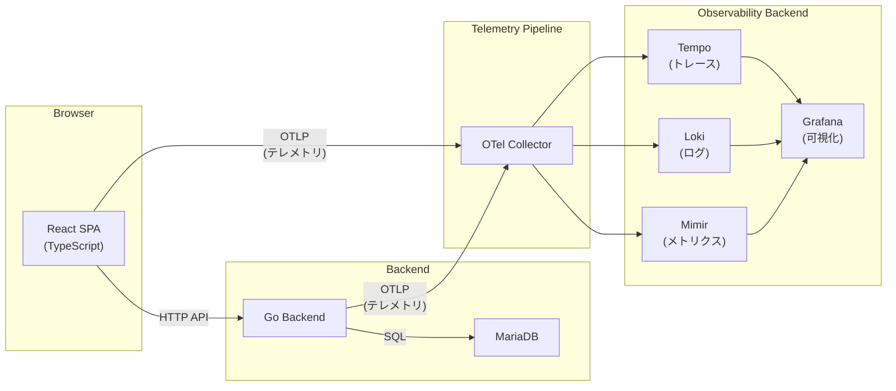
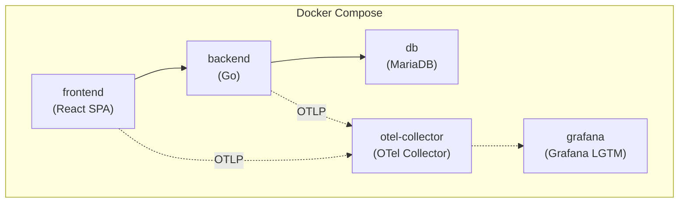

# アーキテクチャと技術スタック

## システム構成図



## 各コンポーネントの説明

### React SPA（フロントエンド）

| 項目 | 内容 |
|------|------|
| 言語 | TypeScript |
| フレームワーク | React |
| 構成 | SPA（Single Page Application） |
| OTel SDK | OpenTelemetry JS SDK |

ユーザーが直接操作するフロントエンドアプリケーション。OTel JS SDK を組み込み、ブラウザ上でのユーザー操作やHTTPリクエストをトレースとして計装する。テレメトリデータは OTLP プロトコルで OTel Collector に送信する。

### Go Backend（バックエンド）

| 項目 | 内容 |
|------|------|
| 言語 | Go |
| OTel SDK | OpenTelemetry Go SDK |

フロントエンドからのAPIリクエストを処理するバックエンドサーバー。OTel Go SDK を組み込み、HTTPハンドラやデータベースアクセスをトレースとして計装する。フロントエンドから伝播されたトレースコンテキスト（W3C Trace Context）を受け取り、分散トレースを構成する。

### MariaDB（データベース）

| 項目 | 内容 |
|------|------|
| 用途 | アプリケーションデータの永続化 |

バックエンドが利用するリレーショナルデータベース。Go Backend からの SQL クエリを処理する。

### OpenTelemetry Collector（テレメトリ中継）

| 項目 | 内容 |
|------|------|
| 役割 | テレメトリデータの受信・加工・転送 |
| プロトコル | OTLP（gRPC / HTTP） |

フロントエンドとバックエンドの両方からテレメトリデータを受信し、Grafana LGTM スタックの各コンポーネントに転送する中継地点。レシーバー、プロセッサー、エクスポーターのパイプライン構成で柔軟なデータ処理が可能。

### Grafana LGTM スタック（Observability バックエンド）

| コンポーネント | 役割 | 対応シグナル |
|---------------|------|-------------|
| **Tempo** | 分散トレースの保存・検索 | トレース |
| **Loki** | ログの集約・検索 | ログ |
| **Mimir** | メトリクスの保存・クエリ | メトリクス |
| **Grafana** | ダッシュボードによる可視化・分析 | 全シグナル |

Grafana LGTM は、Grafana Labs が提供するオープンソースの Observability スタック。各テレメトリシグナルに特化したバックエンドと、統合的な可視化レイヤーを提供する。

## 技術選定理由

| 技術 | 選定理由 |
|------|---------|
| **React + TypeScript** | フロントエンド OTel SDK の学習対象として。TypeScript による型安全な OTel API の利用を体験する |
| **Go** | OTel Go SDK のエコシステムが成熟しており、バックエンドの計装例として適切 |
| **MariaDB** | 軽量な RDBMS として、DB トレースの学習に利用 |
| **OTel Collector** | ベンダー非依存のテレメトリパイプラインとして標準的な選択肢。直接バックエンドに送信する構成と比較して、柔軟性と拡張性に優れる |
| **Grafana LGTM** | OSS で構築可能な Observability スタック。トレース・メトリクス・ログの3シグナルを単一のUIで確認できる |
| **Docker Compose** | ローカル環境で複数コンテナを簡単に立ち上げられる。学習・検証用途に最適 |

## Docker Compose でのインフラ構成概要

全コンポーネントを Docker Compose で管理し、`docker compose up` 一つで環境全体を起動できる構成とする。



各サービスは同一の Docker ネットワーク上で通信する。テレメトリデータの送信経路（点線）とアプリケーションのデータフロー（実線）を分離して管理する。

## テレメトリデータの流れ

フロントエンド・バックエンドの両方から、3種類のテレメトリシグナルが OTel Collector を経由して Grafana LGTM スタックに流れる。

### トレース

```
React SPA ---[OTLP]---> OTel Collector ----> Tempo ----> Grafana
Go Backend --[OTLP]---> OTel Collector ----> Tempo ----> Grafana
```

- フロントエンドでユーザー操作やHTTPリクエストのスパンを生成
- バックエンドでAPIハンドラやDBクエリのスパンを生成
- W3C Trace Context ヘッダーにより、フロントエンドとバックエンドのスパンが同一トレースとして関連付けられる
- OTel Collector が受信したスパンを Tempo に転送
- Grafana でトレースの全体像をウォーターフォール表示で確認

### メトリクス

```
React SPA ---[OTLP]---> OTel Collector ----> Mimir ----> Grafana
Go Backend --[OTLP]---> OTel Collector ----> Mimir ----> Grafana
```

- 各アプリケーションからカウンター、ヒストグラム等のメトリクスを送信
- OTel Collector が受信したメトリクスを Mimir に転送
- Grafana でダッシュボードやアラートに利用

### ログ

```
React SPA ---[OTLP]---> OTel Collector ----> Loki ----> Grafana
Go Backend --[OTLP]---> OTel Collector ----> Loki ----> Grafana
```

- 各アプリケーションからログレコードを送信
- トレースIDとの関連付けにより、ログからトレースへのジャンプが可能
- OTel Collector が受信したログを Loki に転送
- Grafana の Explore 画面でログの検索・フィルタリングが可能
