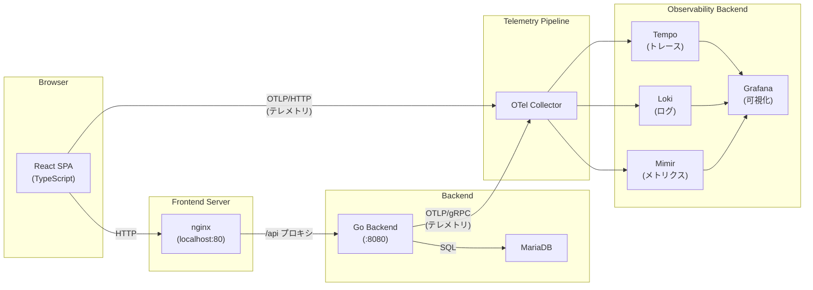

# アーキテクチャと設計思想

## システム構成図



## テレメトリデータの流れ

フロントエンドとバックエンドの両方から、3種類のテレメトリシグナルが OTel Collector を経由して Grafana LGTM スタックに流れる。

### トレース

```
React SPA  --[OTLP/HTTP]--> OTel Collector --> Tempo --> Grafana
Go Backend --[OTLP/gRPC]--> OTel Collector --> Tempo --> Grafana
```

フロントエンドでユーザー操作や HTTP リクエストのスパンを生成し、バックエンドで API ハンドラや DB クエリのスパンを生成する。W3C Trace Context ヘッダーにより、フロントエンドとバックエンドのスパンが同一トレースとして関連付けられる。

### メトリクス

```
React SPA  --[OTLP/HTTP]--> OTel Collector --> Mimir --> Grafana
Go Backend --[OTLP/gRPC]--> OTel Collector --> Mimir --> Grafana
```

フロントエンドは `MeterProvider` を通じてカスタムメトリクス（カウンター・ヒストグラム）を生成する。バックエンドも OTel Go SDK の `MeterProvider` で同様にカスタムメトリクスを生成する。収集されたメトリクスは Mimir（Prometheus 互換）に保存され、Grafana の Prometheus データソースからクエリできる。

### ログ

```
React SPA  --[OTLP/HTTP]--> OTel Collector --> Loki --> Grafana
Go Backend --[OTLP/gRPC]--> OTel Collector --> Loki --> Grafana
```

フロントエンドは `LoggerProvider` を通じて構造化ログを OTel Collector に送信する。バックエンドは `otelslog` ブリッジを使い、標準ライブラリの `slog` によるログを OTel ログとして送信する。ログにはトレース ID とスパン ID が自動付与されるため、Grafana の Loki 画面からそのまま対応するトレースへジャンプできる。

## 技術選定の理由

### React + TypeScript

このプロジェクトの主要学習ゴールは**フロントエンド TypeScript での OTel SDK 利用**である。TypeScript を選んだのは、OTel API の型情報を活用した型安全な計装コードを書ける点が学習に適しているからだ。JavaScript より早期にミスを検出でき、SDK の使い方を IDE の補完で確認しながら進められる。

### Go（バックエンド）

OTel Go SDK はエコシステムが成熟しており、`otelhttp`（HTTP ハンドラの自動計装）や `otelsql`（SQL クエリの自動計装）など計装ライブラリが充実している。バックエンドの計装パターンを学ぶ対象として適切な選択だった。

### フロントエンドが OTLP/HTTP を使う理由

ブラウザ環境では gRPC（HTTP/2）を直接使用できないため、フロントエンドは OTLP/HTTP を使用している。バックエンドはサーバー間通信であるため gRPC を使用しており、この違いは OTel JS SDK と Go SDK の設定差として現れる。JS SDK では `OTLPTraceExporter` に `http://localhost:4318` を指定し、Go SDK では `otlptracegrpc` で `otel-collector:4317` を指定している。

### OTel Collector（別コンテナとして分離）

Grafana LGTM イメージには Collector が内包されているが、このプロジェクトでは意図的に別コンテナとして分離している。理由は、**Collector のパイプライン設定（レシーバー・プロセッサー・エクスポーター）を明示的に学ぶ**ことがゴールの一つだからだ。設定ファイルを直接編集して挙動を確認できる構成にしている。

OTel Collector を挟む構成には以下のメリットもある。

- アプリケーションからバックエンドを直接変更せずに転送先を変更できる
- バッチ処理やフィルタリングなどのデータ加工をアプリケーション側に持ち込まなくて済む
- ベンダー非依存のテレメトリパイプラインとして本番環境でも使えるパターンを学べる

### Grafana LGTM スタック

OSS で構築可能な Observability スタックとして、トレース・メトリクス・ログの3シグナルを単一の UI で確認できる。`grafana/otel-lgtm` イメージは Tempo、Loki、Mimir、Grafana を all-in-one で提供するため、学習環境の構築コストが低い。

### Docker Compose

複数コンテナで構成される Observability スタック全体を `docker compose up` 一つで起動できる。サービス間の依存関係（`depends_on`）や環境変数の注入もここで管理しており、学習環境の再現性が高い。

## 設計上のトレードオフ

### アプリケーションの単純さ

バックエンドは net/http を直接使ったシンプルな実装であり、フレームワークは使っていない。Todo CRUD という最小限のドメインを選んだのは、**アプリケーションのロジックでなく OTel の計装に集中できるようにする**ためだ。

### セキュリティの非対応

DB のパスワードや OTel エンドポイントを docker-compose.yml に平文で記述している。これは学習・ローカル環境専用の構成であり、本番環境に適用することは想定していない。

### フロントエンドの OTLP 送信

ブラウザから OTel Collector に直接 OTLP/HTTP で送信している。OTel Collector には CORS 設定を入れている。本番環境では CORS の扱いやブラウザから Collector を公開する是非を慎重に検討する必要があるが、学習目的では最もシンプルな経路として採用した。

### W3C Trace Context と nginx

nginx のリバースプロキシを経由する際、HTTP ヘッダーの転送設定を適切に行わないと `traceparent` ヘッダーが欠落する。`nginx.conf` でカスタムヘッダーの転送を明示的に設定することで分散トレーシングを維持している。
