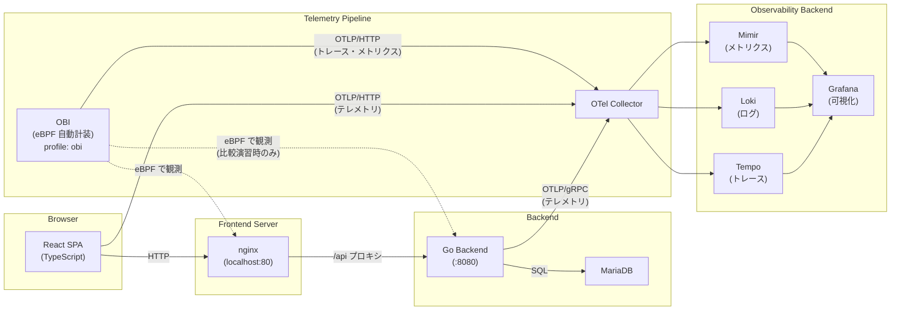

# アーキテクチャと設計思想

## システム構成図


```mermaid
graph LR
    subgraph Browser
        React["React SPA<br/>(TypeScript)"]
    end

    subgraph "Frontend Server"
        nginx["nginx<br/>(localhost:80)"]
    end

    subgraph Backend
        Go["Go Backend<br/>(:8080)"]
        DB["MariaDB"]
    end

    subgraph "Telemetry Pipeline"
        Collector["OTel Collector"]
        OBI["OBI<br/>(eBPF 自動計装)<br/>profile: obi"]
    end

    subgraph "Observability Backend"
        Tempo["Tempo<br/>(トレース)"]
        Loki["Loki<br/>(ログ)"]
        Mimir["Mimir<br/>(メトリクス)"]
        Grafana["Grafana<br/>(可視化)"]
    end

    React -- "HTTP" --> nginx
    nginx -- "/api プロキシ" --> Go
    Go -- "SQL" --> DB

    React -- "OTLP/HTTP<br/>(テレメトリ)" --> Collector
    Go -- "OTLP/gRPC<br/>(テレメトリ)" --> Collector
    OBI -. "eBPF で観測" .-> nginx
    OBI -. "eBPF で観測<br/>(比較演習時のみ)" .-> Go
    OBI -- "OTLP/HTTP<br/>(トレース・メトリクス)" --> Collector

    Collector --> Tempo
    Collector --> Loki
    Collector --> Mimir

    Tempo --> Grafana
    Loki --> Grafana
    Mimir --> Grafana
```

## テレメトリデータの流れ

フロントエンドとバックエンドの両方から、3種類のテレメトリシグナルが OTel Collector を経由して Grafana LGTM スタックに流れる。

### トレース

```
React SPA  --[OTLP/HTTP]--> OTel Collector --> Tempo --> Grafana
Go Backend --[OTLP/gRPC]--> OTel Collector --> Tempo --> Grafana
OBI (nginx を eBPF で観測) --[OTLP/HTTP]--> OTel Collector --> Tempo --> Grafana   ※ profile obi 有効時
```

フロントエンドでユーザー操作や HTTP リクエストのスパンを生成し、バックエンドで API ハンドラや DB クエリのスパンを生成する。W3C Trace Context ヘッダーにより、フロントエンドとバックエンドのスパンが同一トレースとして関連付けられる。

### メトリクス

```
React SPA  --[OTLP/HTTP]--> OTel Collector --> Mimir --> Grafana
Go Backend --[OTLP/gRPC]--> OTel Collector --> Mimir --> Grafana
OBI (nginx を eBPF で観測) --[OTLP/HTTP]--> OTel Collector --> Mimir --> Grafana   ※ profile obi 有効時
```

フロントエンドは `MeterProvider` を通じてカスタムメトリクス（カウンター・ヒストグラム）を生成する。バックエンドも OTel Go SDK の `MeterProvider` で同様にカスタムメトリクスを生成する。収集されたメトリクスは Mimir（Prometheus 互換）に保存され、Grafana の Prometheus データソースからクエリできる。

### ログ

```
React SPA  --[OTLP/HTTP]--> OTel Collector --> Loki --> Grafana
Go Backend --[OTLP/gRPC]--> OTel Collector --> Loki --> Grafana
```

フロントエンドは `LoggerProvider` を通じて構造化ログを OTel Collector に送信する。バックエンドは `otelslog` ブリッジを使い、標準ライブラリの `slog` によるログを OTel ログとして送信する。ログにはトレース ID とスパン ID が自動付与されるため、Grafana の Loki 画面からそのまま対応するトレースへジャンプできる。

## 技術選定の理由

### React + TypeScript

このプロジェクトの主要学習ゴールは**フロントエンド TypeScript での OTel SDK 利用**である。TypeScript を選んだのは、OTel API の型情報を活用した型安全な計装コードを書ける点が学習に適しているからだ。JavaScript より早期にミスを検出でき、SDK の使い方を IDE の補完で確認しながら進められる。

### Go（バックエンド）

OTel Go SDK はエコシステムが成熟しており、`otelhttp`（HTTP ハンドラの自動計装）や `otelsql`（SQL クエリの自動計装）など計装ライブラリが充実している。バックエンドの計装パターンを学ぶ対象として適切な選択だった。

### フロントエンドが OTLP/HTTP を使う理由

ブラウザ環境では gRPC（HTTP/2）を直接使用できないため、フロントエンドは OTLP/HTTP を使用している。バックエンドはサーバー間通信であるため gRPC を使用しており、この違いは OTel JS SDK と Go SDK の設定差として現れる。JS SDK では `OTLPTraceExporter` に `http://localhost:4318` を指定し、Go SDK では `otlptracegrpc` で `otel-collector:4317` を指定している。

### OTel Collector（別コンテナとして分離）

Grafana LGTM イメージには Collector が内包されているが、このプロジェクトでは意図的に別コンテナとして分離している。理由は、**Collector のパイプライン設定（レシーバー・プロセッサー・エクスポーター）を明示的に学ぶ**ことがゴールの一つだからだ。設定ファイルを直接編集して挙動を確認できる構成にしている。

OTel Collector を挟む構成には以下のメリットもある。

- アプリケーションからバックエンドを直接変更せずに転送先を変更できる
- バッチ処理やフィルタリングなどのデータ加工をアプリケーション側に持ち込まなくて済む
- ベンダー非依存のテレメトリパイプラインとして本番環境でも使えるパターンを学べる

### Grafana LGTM スタック

OSS で構築可能な Observability スタックとして、トレース・メトリクス・ログの3シグナルを単一の UI で確認できる。`grafana/otel-lgtm` イメージは Tempo、Loki、Mimir、Grafana を all-in-one で提供するため、学習環境の構築コストが低い。

### Docker Compose

複数コンテナで構成される Observability スタック全体を `docker compose up` 一つで起動できる。サービス間の依存関係（`depends_on`）や環境変数の注入もここで管理しており、学習環境の再現性が高い。

### SDK 計装と eBPF 自動計装（OBI）

Phase 9 で追加した [OBI（OpenTelemetry eBPF Instrumentation）](https://opentelemetry.io/ja/docs/zero-code/obi/) は、Linux カーネルの eBPF 機能でプロセスのシステムコールやネットワーク通信を外側から観測し、HTTP / gRPC / SQL などのプロトコル境界でスパンと RED メトリクスを生成する。アプリケーションのコード・設定・再ビルドは不要で、OBI コンテナを横に置くだけで動く。

このプロジェクトでは、SDK を組み込めない **nginx** を OBI の主な対象にしている。nginx は `traceparent` ヘッダーを転送するだけで自身のスパンは出せなかったが、OBI により nginx の server span（と内部の `in queue` / `processing`）、backend への client span がトレースに加わる。

**SDK と OBI は置き換えではなく補完の関係にある。**

| 観点 | SDK 計装 | OBI（eBPF） |
|---|---|---|
| 得意なこと | コードの意図を表す内部スパン、ビジネス属性、ログとの紐付け | コード変更なしでプロトコル境界を網羅的に観測 |
| 苦手なこと | SDK のない言語・改修できないコード・サードパーティのバイナリ | 内部処理の意味、任意の属性、ログ |
| 導入コスト | 言語ごとの SDK 導入とコード変更 | privileged コンテナ 1 つ |
| 必要な権限 | なし | `pid: host` と特権（eBPF プログラムのロード、他プロセスのメモリ・ネットワーク観測） |

#### 設定ファイルを 2 つに分けている理由

OBI には、OTLP を送信しているプロセス（= すでに SDK で計装されている）を自動的に計装対象から外す機能（`discovery.exclude_otel_instrumented_services`、既定で有効）がある。ただしこの検知は挙動ベースで、「OBI 自身が観測した client span が OTLP のエクスポートに見えるか」で判定する。backend のように単一の gRPC エンドポイントへ全シグナルを送る構成では、ポートからシグナル種別を特定できず検知が発火しない（upstream の [devdocs](https://github.com/open-telemetry/opentelemetry-ebpf-instrumentation/blob/main/devdocs/exclude-otel-instrumented-services.md) に明記されている制約）。

そのため本プロジェクトでは自動除外に頼らず、`obi/config.yaml`（nginx のみ）と `obi/config-compare.yaml`（nginx + backend）を `OBI_CONFIG` 環境変数で明示的に切り替える。比較用の設定では、環境差で挙動が変わらないよう自動除外を明示的に無効にしている。

#### Compose profile でオプトインにしている理由

`privileged: true` と `pid: host` を持つコンテナはホスト上の全プロセスを観測できる。学習環境とはいえ常時起動させる必然性はなく、Phase 1〜8 の体験を変えないためにも、`docker compose --profile obi up` と明示したときだけ起動する構成にした。

## 設計上のトレードオフ

### アプリケーションの単純さ

バックエンドは net/http を直接使ったシンプルな実装であり、フレームワークは使っていない。Todo CRUD という最小限のドメインを選んだのは、**アプリケーションのロジックでなく OTel の計装に集中できるようにする**ためだ。

### セキュリティの非対応

DB のパスワードや OTel エンドポイントを docker-compose.yml に平文で記述している。これは学習・ローカル環境専用の構成であり、本番環境に適用することは想定していない。

### フロントエンドの OTLP 送信

ブラウザから OTel Collector に直接 OTLP/HTTP で送信している。OTel Collector には CORS 設定を入れている。本番環境では CORS の扱いやブラウザから Collector を公開する是非を慎重に検討する必要があるが、学習目的では最もシンプルな経路として採用した。

### W3C Trace Context と nginx

nginx のリバースプロキシを経由する際、HTTP ヘッダーの転送設定を適切に行わないと `traceparent` ヘッダーが欠落する。`nginx.conf` でカスタムヘッダーの転送を明示的に設定することで分散トレーシングを維持している。

### eBPF の環境依存

OBI は Linux カーネル 5.8 以降と BTF を必要とし、Docker Desktop では内部の Linux VM 上で動作する。eBPF の挙動はカーネルや Docker のバージョンに依存するため、SDK 計装に比べて「どの環境でも同じように動く」保証は弱い。本プロジェクトは Docker Desktop（macOS / arm64）で検証しており、そこで観測した環境依存の挙動は次のとおり。

| 挙動 | Docker Desktop での結果 | 対応 |
|---|---|---|
| `ebpf.context_propagation: all` による HTTP ヘッダー注入 | カーネルの `FIONREAD` 問題で無効化され、起動時に ERROR ログが出る。ブラウザ起点のトレースでは nginx と backend が兄弟として並ぶ（ヘッダー注入が有効なカーネルでは backend が nginx の下にぶら下がる） | 設定は残し、チュートリアルで環境差を説明 |
| `open_ports` による対象の選択 | 公開ポートを VM 内の `dockerd` も開いているため、`dockerd` まで計装対象に入る。`containers_only: true` でも除外されない | `exe_path` を併用して実行ファイル名でも絞る |
| OBI コンテナの停止 | `pid: host` のため、SIGTERM 後にプロセスが終了しても回収が遅れ、既定の 10 秒で "PID is zombie" エラーになる | `stop_grace_period: 60s` を設定 |
